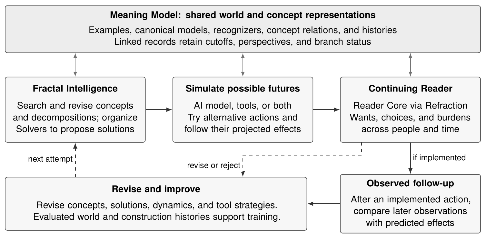

# Life Simulation

## Learning from Worlds and Their Construction

Life Simulation proposes learning to construct and refine numerical accounts
of evolving worlds, aiming to develop a process sensorium. One expanding
Meaning Model brings together collected world data, inferred missing values,
and invented conceptual processes. Conceptual values gain meaning through
comparison with other categories under a declared question; empirical values
retain their units and uncertainty. Events, numerical histories, concepts,
text, and expressed understanding are linked. Training on these accounts and
their construction could improve the models that produce subsequent learning
material.

The long-term goal is an automated loop that progressively develops world
histories, proposes and tests alternative decompositions, and learns from
revisions. It covers people, economies, institutions, and environments.
Narrative-world construction is the first controlled laboratory: tests ask
whether invented numerical processes support coherent worlds and distinctive
characters whose behavior genuinely depends on those processes. A secondary
two-round pilot tests learned modeling decisions and downstream learning.
The Book of Conditions provides a first narrative construction result;
controlled comparisons and Student-training results remain prospective.
More capable models could discover useful conceptual processes beyond current
vocabularies. Combined training with Entangled Alignment aims to develop care
alongside capability: Life Simulation deepens understanding of people's wants
and needs, while the continuing Reader applies a stable evaluative Core.
These learning and safety benefits remain to be tested.

[Read the paper](output/pdf/life-simulation.pdf) ·
[Zenodo](https://zenodo.org/records/22348228) ·
[LaTeX source](paper/life-simulation.tex)

Henrik Westerberg · September 5, 2026

DOI: [10.5281/zenodo.22348228](https://doi.org/10.5281/zenodo.22348228)

## Proposed integration



Fractal Intelligence searches for useful concepts and problem decompositions,
not only those already named by people. Simulation explores what could happen
if a proposed solution were implemented. The continuing Reader applies the
Reader Core through Refraction to evaluate effects on people's wants, choices,
and burdens over time. These are functional roles, not necessarily separate
AI models: simulation can use an AI model, numerical tools, or both. Evaluated
histories can support training, while better tools and strategies can improve
the next attempt without retraining.

The companion [Meaning Model repository](https://github.com/emergent-wisdom/meaning-model)
contains the world representation, Rust implementation, MCP tools, and
*The Book of Conditions*.

## Build the paper

Install a LaTeX distribution with `latexmk`, pdfLaTeX, BibTeX, and the packages
used by the source, then run:

```sh
make paper
```

The PDF is written to `output/pdf/life-simulation.pdf`. No Node.js, Rust,
or companion checkout is needed. Run `make clean` to remove temporary build files.

## License

The paper, documentation, and figure are [CC BY 4.0](LICENSE-CONTENT).
Build and LaTeX style code are [MIT](LICENSE). See [NOTICE](NOTICE) for scope.
